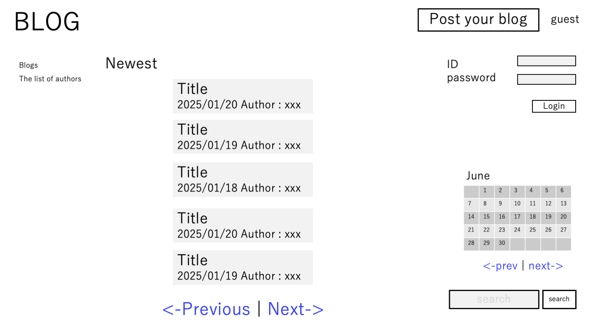
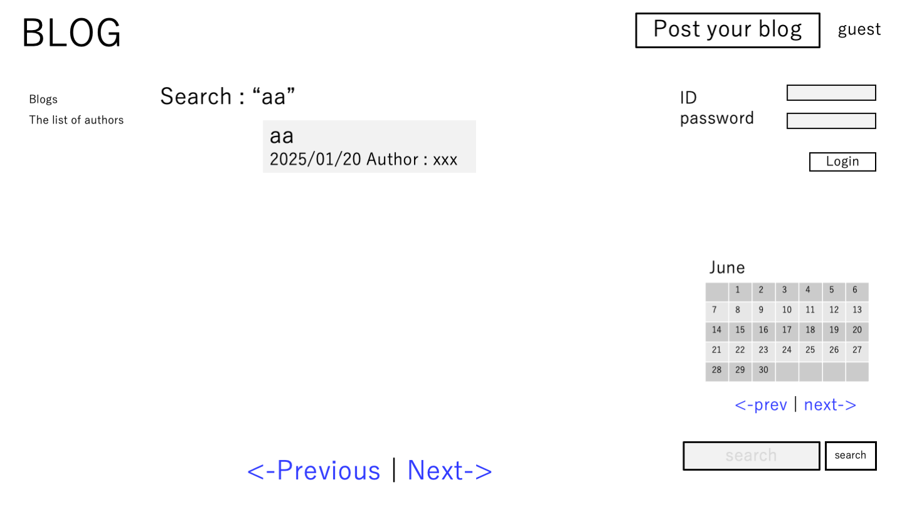
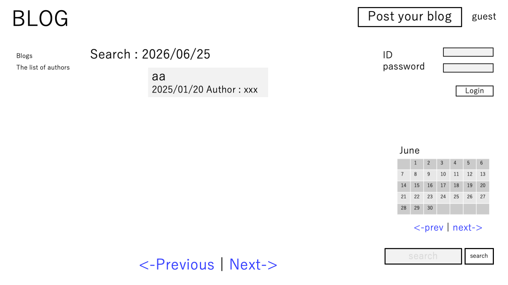
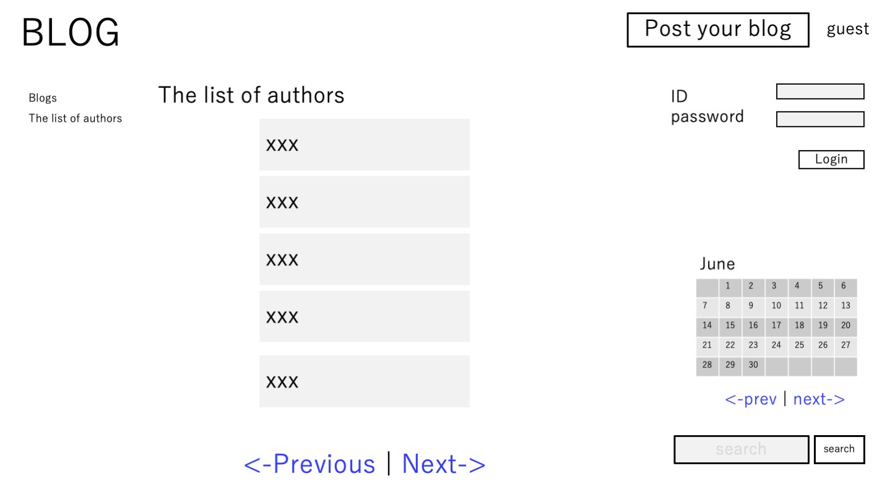
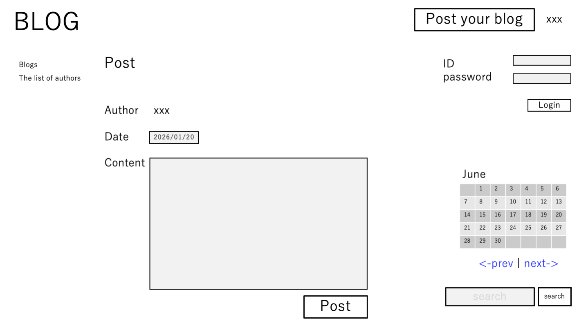
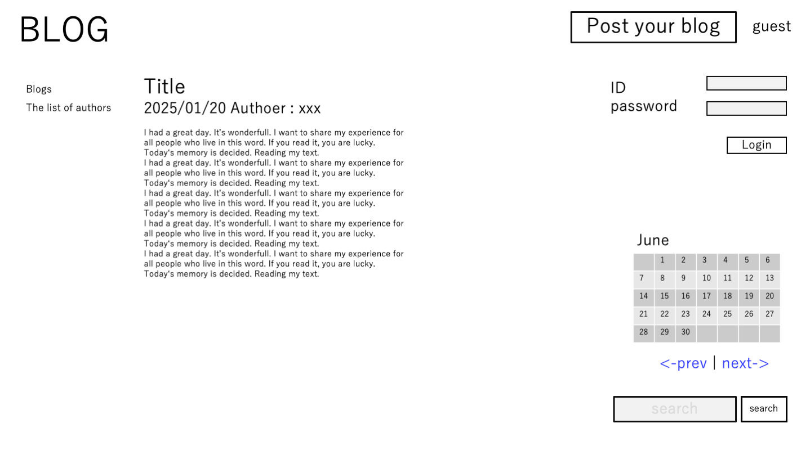
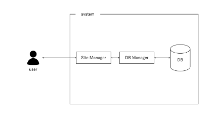

# The blogs
s1320047 ASAI Haruhiko

## General Description
The proposed web application allows the user to create blog posts in a shared blog space.

## Main user actions
The user can 
1.	Display all blog posts sorted by date, with the most recent post shown first.
2.	Display the list of authors.
3.	Show only the blog posts written by a selected author.
4.	Select a date in the calendar and display all posts written on that day.
5.	Register in the system with a unique user name and password, and start writing their own blog posts.
6.	Find all blog posts matching a user query.

## Note
1.	Each blog post is associated with an author, and consists of a title, text content, and creation date.
2.	Initially, the database should contain A authors (about 5) and N blog posts (about 20).
3.	The system should not display more than P posts per page. If there are more matching posts, the app should display “Next” and “Previous” links for pagination.
4.	For the search function, the user types a string in the search box, and the system returns all blog posts containing in the title.

## User interface (sketch)

Home

Search

author

post blog page

Blog text page

## Basic data model idea

The database will contain two tables:

### Table user
| Column | Type | Comment |
| --- | --- | --- |
| id | int | Unique user name|
| password | string | Password |

### Table article

| Column | Type | Comment |
| --- | --- | --- |
| title | string | Title of the blog |
| author | string | Author name of the blog |
| content | string | The content of the blog |
| creationDate | date | The date created the blog |

## Project plan
1.	Set up the development environment.
2.	Create the database and design its structure.
3.	Implement the business logic.
4.	Create a simple HTML prototype of the interface.
5.	Add richer interaction to the interface.
## Main data entities
- We need some objects. Such as, Buttons, forms. 
- Buttons are Blog_Rogo to jump to the top page, 
- Post_Your_Blog to jump to Post Blog page, 
- Login to login to your account, 
- Post to add a new blog data to DB, 
- Blog_Title to jump to blog text page,
- Authoer to jump to author’s blogs page,
- search to jump to search result page,
- Previous/next to switch blogs list,
- and prev/next to switch calendear page.
- Forms are Id, password. form to input your account data, 
- and search form to search blogs from DB.
- Also, we need the blog object have a blog’s information,
- and the calendear object.

## Main user flow

Enter page: show the page sort by date. 
Login: input id and password → login to the account if id and password are valid. 
Post Blog: input blog information → record the content to DB. 
Search: write string on form and click search → show search result 
Search-date: click the day of calendar　→ show search result 

## Architecture sketch
